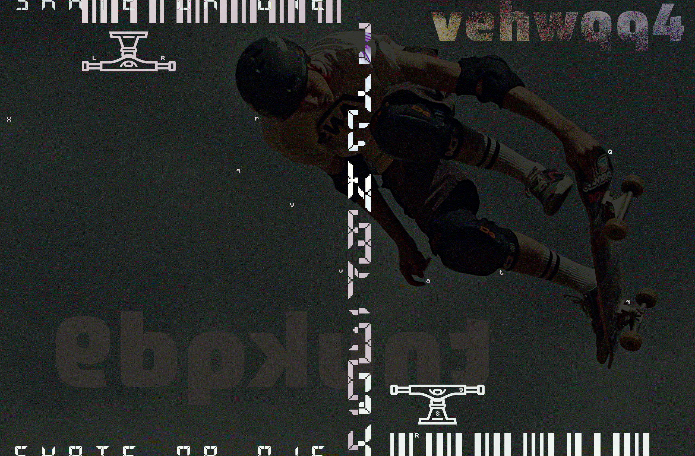
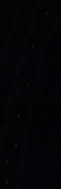
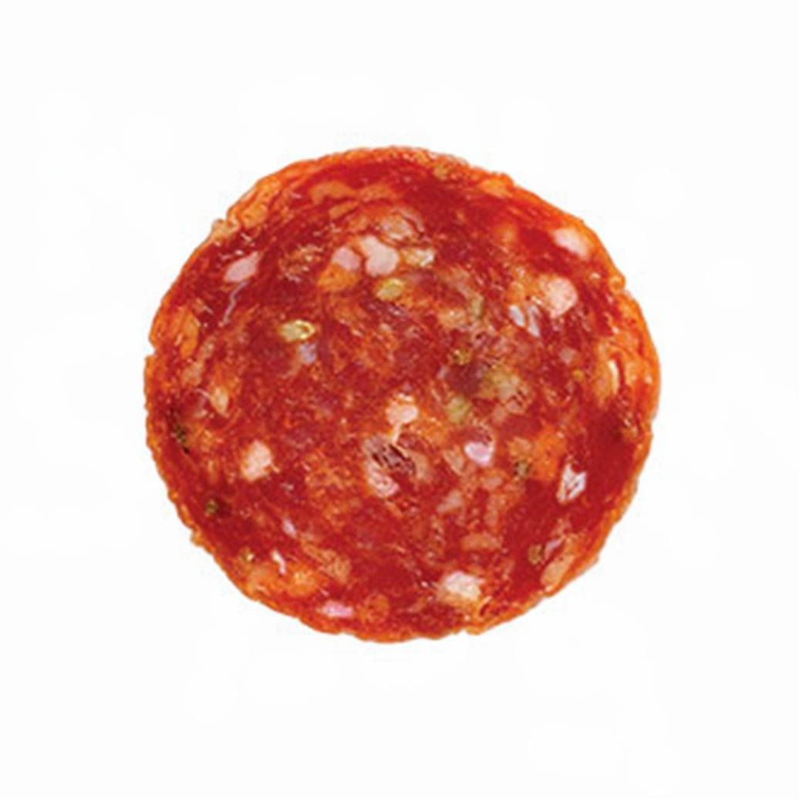

![Channel Profile Picture]
 
**The User Profile Picture**

On November 8, 2019, the Reddit user [u/johndough1983](https://www.reddit.com/user/johndough1983/) was created.

[Channel Profile Picture]: ../assets/img/profileIcon_886yhcqde7c41.jpg
{:width="500px"}

## Posts

Since the creation of the account, multiple posts have been created.

<b style="font-weight:600; ">The Skater</b>

 

 
<strong>The Image Posted</strong>
 

On November 21, 2019, the Reddit user <a href="https://www.reddit.com/user/johndough1983/">u/johndough1983</a> created <a href="https://www.reddit.com/r/codes/comments/dzfq29/this_dude_has_8_different_secrets_to_tell">this post</a>, titled: &quot;This dude has 8 different secrets to tell&quot;.
The post contained the above image.
 

<h2 id="visible-secrets">Visible Secrets</h2>
The first few secrets can be found with the naked eye.
 
<h3>1. The QR Code</h3>
In the bottom-left corner of the image, the following QR code is clearly visible:
 

 
This code leads to a <a href="https://lensdump.com/i/skrinair-2.iLdReq">LensDump Image</a>, essentially just a high-resolution version of the posted image, lacking the QR code:
 

 

<h3>2. Faded Text</h3>
On the right-center of the image, the following text can be seen, very faintly:
 

 
<code>vehwqq4</code>
 
The corresponding TinyURL link leads to the following <a href="https://pxhere.com/sv/photo/668890">PxHere Photo</a>, however for some reason the page is in Swedish.
 
It appears to be the original source image:
 

 

At this point, it is helpful to re-align the image&#39;s translation:
 

 

<h3>3. Misaligned Text</h3>
Down the middle of the image, a column of misaligned letters can be found. Realigning them yields the following text:
 

 
<code>QKFN3CJ</code>
 
The corresponding TinyURL link leads to timestamp 1:12 of <a href="https://www.youtube.com/watch?v=l3D6WLWYJoE&amp;t=72s">this video</a>, which happens to be <a href="../youtube/video-nine">video 9</a> from the <a href="../youtube">YouTube channel</a>.

<h2 id="image-difference">Image Difference</h2>
At this point it is helpful to get the difference between the high-res image, and the source image:
 

 

<h3>4. White Text</h3>
Across the image, the following text is visible:
 

 
<code>rqyvatq</code>
 
The corresponding TinyURL link redirects to the <a href="https://twitter.com/thedudesoflord">Twitter Page</a> of <em>The Dudes of Lord</em>, a band of which <a href="../lore/characters/paul">Paul Sherfick</a> was a member.

<h3>5. Morse Code</h3>
The barcode of the image translates to morse code:
 

 
<code>rqyvatq</code>
 
This is the same as the previous secret, which is quite odd. We determined the order of the barcode stripes, as the letter r happens to be next the the first set of lines which form &quot;r&quot; in morse.

<h3 id="6-leftover-text">6. Leftover Text</h3>
Once we discard the r under the trucks, and the LR on the upper trucks as a reading order indicator, we are left with the following info:
 

 
<code>XQK89Q</code>
 
The corresponding TinyURL link redirects to <a href="https://myspace.com/">MySpace</a>. The significance of this is ultimately unknown, however given the running theme we can assume that the <a href="https://myspace.com/thedudesoflordband">Dudes of Lord MySpace page</a> is significant.

<h2 id="7-levels">7. Levels</h2>
After modifying the levels of the difference between the original and modified images, the following text is visible:
 

 
<code>tnukqd9</code>
 
The corresponding TinyURL link leads to the Dudes of Lord <a href="https://www.reverbnation.com/thedudesoflord">ReverbNation Page</a>.
<h2 id="8-hex-code">8. Hex Code</h2>
When opened in a hex editor, the following message is repeated 31 times at the end of the high-resolution image:
 

So you've made it this far out on the branches without falling. 
Impressive. 
Does it make sense yet, or do you need me to hold your hand a bit longer? 
Try this one - vt64rz3

The corresponding TinyURL link redirects to an <a href="https://www.indystar.com/story/news/crime/2017/06/09/how-ex-cop-david-bisard-slashed-his-16-year-sentence-serve-only-4/379026001/">Indy Star article</a>
regarding the early release of former IMPD officer <a href="../lore/characters/david">David Bisard</a>.

---

<b style="font-weight:600; ">The QR Code</b>

 

<strong>Figure A: The posted image</strong>
  
On November 27, 2019, the Reddit user <a href="https://www.reddit.com/user/johndough1983/">u/johndough1983</a> created <a href="https://www.reddit.com/r/codes/comments/e2l5o0/three_steps_to_solve_this/">this post</a>, titled: &quot;Three steps to solve this&quot;.
The image provided was a scrambled QR code, which when reassembled looked like the following:

<strong>Figure B: Restored QR Code</strong>
  
This code redirects to the following PDF:
 
<iframe src="../assets/failure-protocol-001-smol.pdf" width="100%" height="500px"></iframe>

---

<b style="font-weight:600; ">The Pope</b>

 

<strong>The Image Posted</strong>
 

On November 30, 2019, the Reddit user <a href="https://www.reddit.com/user/johndough1983/">u/johndough1983</a> created <a href="https://www.reddit.com/r/codes/comments/e41d1r/this_pope_has_10_things_he_doesnt_want_you_to/">this post</a>, titled: &quot;This Pope has 10 things he doesn’t want you to find out&quot;.
The post contained the above image, a horizontally inverted, modified version of the following image of Pope John XXIII:
 

<strong>The original image</strong>
 

A higher-resolution image, missing some information, was also provided to the Discord by user John4-16 (<a href="../lore/characters/jon">Jon Doe</a>):
 

 

<h2>Coupon Code</h2>

Upon <a href="http://github.com/exvacuum">Silas</a>&#39; successful collection of 10 secrets, the OP responded with a comment including the following coupon code for &quot;free garlic sticks&quot;:

the pope’s pizza

<h2 >Visible Secrets</h2>

The first few secrets can be found with the naked eye. The first step. however, is to horizontally flip the image:
 

 

<h3 >1. The QR Code</h3>

In the top-right corner of the image, the following QR code is clearly visible:
 

This code leads to a <a href="http://www.dailyjournal.net/2019/11/09/roncalli_football_claims_sectional_championship/">Daily Journal article</a> about the success of the <a href="https://www.roncalli.org/">Roncalli High School</a> football team. Roncalli High School is a Catholic secondary school in Indianapolis.

<h3 >2. Edge Text</h3>

The vertical edges of this image each contain half of a string of text, which when assembled form <code>umjpwk2</code>:
 

The corresponding TinyURL link leads to a <a href="https://www.thedailybeast.com/indiana-high-school-football-players-bullied-and-abused-roncalli-student-with-down-syndrome-his-mom-claims">Daily Beast article</a> regarding the abuse of a Roncalli High School football team manger with Down Syndrome by team members.

<h3 >3. Barcode</h3>

The barcode that runs along the bottom of the image was revealed by the Discord user John4-16 (who was later revealed to be Jon Doe) to be a repeating sequence: <code>- .--. ...-- ..... ----- --.. -.</code>:
 

This, when converted from morse code, creates the string <code>tp350zn</code>. The corresponding TinyURL link leads to a <a href="https://fox59.com/2019/10/25/suspended-priest-faces-3-felony-charges-in-sex-abuse-case-involving-minor/">Fox 59 article</a> regarding sexual abuse charges being faced by a chaplain at Roncalli High School.

<h3 >4. Numbering Under QR Code</h3>

The following numbering under the QR code is only present in the Reddit image:

The numbers read <code>19 01 25 12 05 12 14</code>, which when reverted from a A1Z26 substitution cipher reads: <code>SAYLELN</code>. The corresponding TinyURL link leads to an <a href="https://www.theindychannel.com/news/politics/proposal-to-block-state-funding-from-roncalli-over-counselor-controversy-fails">RTV6 article</a> regarding a proposal to block state funding to Roncalli High School due to religious discrimination against an LGBT faculty member.

<h3 id="5-wingdings">5. Wingdings</h3>

In the Reddit image, very low-resolution wingdings appear on the Pope&#39;s head:

Unfortunately, these do not appear in the high-resolution image. However, after careful analysis the text was found to read <code>v3jrqjp</code>. The corresponding TinyURL link leads to an <a href="https://www.indystar.com/story/news/2019/02/12/roncalli-high-school-chaplain-suspended-amid-sex-abuse-allegation/2853350002/">Indy Star article</a> regarding the previously mentioned allegations against the Roncalli High School chaplain.

<h2>Image Difference</h2>

At this point in time, in order to better search for secrets, it is helpful to get the difference between the high-res posted image and the original:

Now we are able to view almost all modifications made to the original image.

<h3 >6. Bright Lettering</h3>

The following bright lettering dots the image from left to right:

yx4exmgt

The corresponding TinyURL link leads to the following RTV6 broadcast segment regarding an apology from Roncalli High School&#39;s principal for his use of a racial slur during a speech on language that should not be tolerated:

<iframe width="560" height="315" src="https://www.youtube.com/embed/JYT2kZXQKSE" frameborder="0" allow="accelerometer; autoplay; encrypted-media; gyroscope; picture-in-picture" allowfullscreen></iframe>

<h3>7. Red Lettering</h3>

The following red lettering runs down the side of the Pope&#39;s cloak:

sjzvv3k

The corresponding TinyURL link leads to an <a href="https://www.indystar.com/story/news/crime/2019/10/29/indiana-suspended-priest-arrested-hamilton-county-sexual-abuse-case/2493933001/">Indy Star article</a> regarding, yet again, the previously mentioned allegations against the Roncalli High School chaplain.

<h3>8. Purple Text</h3>

The following text is slightly visible where the Pope&#39;s cheek would be:

v48oa54

The corresponding TinyURL link leads to a <a href="https://www.wthr.com/article/thousands-sign-petition-decrying-punishment-roncalli-students-who-protest">WTHR article</a> regarding the public outcry against Roncalli High School&#39;s punishment of students who protest for LGBTQ+ rights.

<h3>9. Red Text</h3>

The following text is slightly visible on the edge of where the Pope&#39;s coat would be:

slehfk3

The corresponding TinyURL link leads to an <a href="https://www.indystar.com/story/news/2019/06/20/brebeuf-roncalli-and-archdiocese-indianapolis-how-cases-compare/1512209001/">Indy Star article</a> comparing similar situations regarding LGBT staff members at Roncalli High School and Brebeuf Jesuit Preparatory School.

<h3>10. Red Morse</h3>

On the inside of where the Pope&#39;s cloak would be, the following morse code appears:

Unfortunately, due to the inconsistent spacing of the dits and dahs, a lot of trial and error was involved in forming the following transcript:

..- . --... .. -- -.. -...

When decoded from morse, this form the string: <code>UE7IMDB</code>. The corresponding TinyURL link leads to an <a href="https://www.colts.com/news/indiana-football-digest-top-games-2019-semi-finals">Indianapolis Colts article</a> containing information about the Indiana Football 2019 semifinals.

<h3>11. White Morse</h3>

In the top-left quadrant of the image, a white morse sequence can be seen:

This sequence was thought to be a red herring once ten secrets had been uncovered. However, Discord user John4-16 (Jon Doe) was able to provide a transcript of the sequence:

...- ...-- -.- .--. --.- .-.. ---

When decoded from morse, this form the string: <code>V3KPQLO</code>. The corresponding TinyURL link leads to a <a href="http://www.dailyjournal.net/2019/11/02/roncalli_football_dominates_crispus_attucks/">Daily Journal article</a> regarding a Roncalli High School football match that went incredibly well.

<h3>12. Divide Image</h3>

The next secret was discovered by accident when applying a divide blending mode to the overlain images, and applying a levels filter:

st6nsx4

The corresponding TinyURL leads to a <a href="https://www.uslaxmagazine.com/fuel/us-lacrosse/born-with-cerebral-palsy-he-found-his-identity-on-the-lacrosse-field">USLacrosse article</a> about a Roncalli High School student, born with cerebral palsy, who was able to become a member of the lacrosse team.

---

<b style="font-weight:600; ">The Pepperoni</b>

 

<strong>Figure A: The original JPEG</strong>

<strong>Figure B: The &quot;identical&quot; PNG</strong>
  
On December 14, 2019, the Reddit user <a href="https://www.reddit.com/user/johndough1983/">u/johndough1983</a> created <a href="https://www.reddit.com/r/codes/comments/ea93ld/whats_behind_this_pepperoni/">this post</a>, titled: &quot;What’s behind this pepperoni?&quot;.
Attached in the transcript was the two images pictured above. Though these images look identical on the surface, messing around in an image manipulation program may quickly reveal a hidden steganographic message. Improper placement of the slightly smaller png creates a large amount of nonsense over the large pepperoni. However, if placed correctly, the image should now look something like this:
  

<strong>Figure C: Difference Between the Two Images, with a Photoshop Levels Layer on Top. (Courtesy of Hooptooth)</strong>
  
The message appears to read: <code>KEY STROKE LOG</code>
<h2>Significance to Lore</h2>

This hidden message was sent out by <a href="../lore/characters/jon">Jon Doe</a>, alerting the <a href="./lore/significantthings/doughsolvers">Dough Solvers</a>, and the <a href="../lore/significantthings/pizzapals.md">Pizza Pals</a> in particular, that his conversations were being monitored via the use of a key logger. This was confirmed on December 17, 2019, in a conversation with Doe:

[12:33 AM] Jon Doe: 5h0W3d up @ 73h r1gh7 71M3. c4N7 74Lk 700 Much n0w bU7 73h L337 M4k32 17 N0n53N51c4L PH0r j0Hn. 1 M w0Rk1N' 0n 50m37H1N' 4 l177l3 l355 0bN0x10u2 Bu7 1 h4v3N7 b33n 4BL3 70 kw173 PH1Gur3 17 0U7 Y37. j00 g07 My P3Pp3R0N1 r1GH7?
 
[12:34 AM] ThatOnePerson2000: 1 d1d, 17 54id k3y5720k3 l09?
 
[12:37 AM] Jon Doe: 7h12 M4Ch1nE h42 4 kEY57ROke Lo9

---

<b style="font-weight:600; ">The Emails</b>

 

<strong>The Image Posted</strong>

On December 29, 2019, the Reddit user <a href="https://www.reddit.com/user/johndough1983/">u/johndough1983</a> created <a href="https://www.reddit.com/r/codes/comments/ehfitq/six_things_hidden_between_the_lines_of_this_basic/">this post</a>, titled: &quot;Six things hidden between the lines of this basic job application&quot;.
The post contained the above image.

<h2>Revealing the Secrets</h2>

Pretty much all the hidden text in this image can be revealed using the rectangular marquee tool and auto contrast:

<h3 id="the-secrets">The Secrets</h3>

1. $26,600,00 aggregate principal amount of city of nd variable rate mf housing revenue bonds

2. cumberland

3. kr8juov

4. 20-2563055

5. 5001061

6. parcel

The TiyURL link for secret 3 leads to a <a href="http://maps.indy.gov/AssessorPropertyCards/">property report card search tool</a>. If we search using the seven-digit secret 5 as the parcel code (secret 6), we get the following result:

Parcel Number: 5001061
State Parcel Number: 49-11-36-104-040.000-570
Full Address: 4100 CONTINENTAL CT
Owner: FOUNDATION FOR AFFORDABLE RENTAL HOUSING INC

4100 Continental Court is the street address of <a href="../lore/organizations/cpapartments">Capital Place Apartments</a> in Indianapolis. 

Secret 4 is the employer identification number of Farh-Lamplighter Affordable Housing Inc., mentioned in the 
FOUNDATION FOR AFFORDABLE RENTAL HOUSING HOLDINGS INC document in <a href="../youtube/video-nineteen#subheading">video 19</a>, 
located on Cumberland Parkway in Atlanta, Georgia (Secret 2).

That leaves secret 1.

$26,600,00 aggregate principal amount of city of nd variable rate mf housing revenue bonds

&quot;nd&quot; is likely in reference to Indianapolis, or &quot;Indy&quot;. &quot;mf&quot; means multi-family. Therefore, the text could read:

$26,600,00 aggregate principal amount of city of Indianapolis variable rate multi-family housing revenue bonds

---

<b style="font-weight:600; ">The Lines</b>

 

<strong>The image posted</strong>
 
On December 31, 2019, the Reddit user <a href="https://www.reddit.com/user/johndough1983/">u/johndough1983</a> created <a href="https://www.reddit.com/r/codes/comments/eiab51/fifteen_lines_fourteen_answers_and_zero_hour_calls/">this post</a>, titled: &quot;Fifteen lines, fourteen answers, and zero hour calls&quot;.
The post contained the above image.

Meanwhile, on #the-computer channel of the <a href="https://discord.gg/Uv2V7Ps">Circle City Contamination Discord server</a>, the following &quot;clean&quot; version of the image was posted:
 

<h2 id="transcript">Transcript</h2>

5byh48w 
 
4wxd5pv 
 
ekt7sft 
 
zjpr3f3 
 
s8w4m5b 
 
3tbu5yv 
 
y3y46wv 
 
qhfor4t 
 
6u28clv 
 
26uk9bw 
 
qeu6rm2 
 
wsfg5sz 
 
pozqnll 
 
fjvds3y
  
66-632156-664134

No solution has be discovered so far. See <a href="https://discord.gg/wZ5DaPJ">#lines</a> in the Discord server for more information.

---

<b style="font-weight:600; ">The Stripes</b>

 

<strong>Figure A: The image posted</strong>

On January 21, 2020, the Reddit user <a href="https://www.reddit.com/user/johndough1983/">u/johndough1983</a> created <a href="https://www.reddit.com/r/codes/comments/erzkcm/13_things_hidden_inside_13_stripes/">this post</a>, titled: &quot;13 Things Hidden Inside 13 Stripes&quot;. 
<a href="https://www.reddit.com/r/ARG/comments/es2cq0/google_adam_driver_rebukes_chastened_historian/">Another Post</a> was made that had the alternate title: &quot;Google Adam Driver Rebukes Chastened Historian With Hidden History&quot;.
The post contained the above image.

Meanwhile, on #the-computer channel of the <a href="https://discord.gg/Uv2V7Ps">Circle City Contamination Discord server</a>, the following alternate version of the image was posted:

This image had a strange filename: &quot;2019-12-17_14_10_28-Video<em>5</em>-_CPPARG_Knowledge_Base&quot; which references the <a href="../youtube/video-five">video 5</a> page on this very site.

No solution has be discovered so far. See <a href="https://discord.gg/wZ5DaPJ">#lines</a> in the Discord server for more information.

---