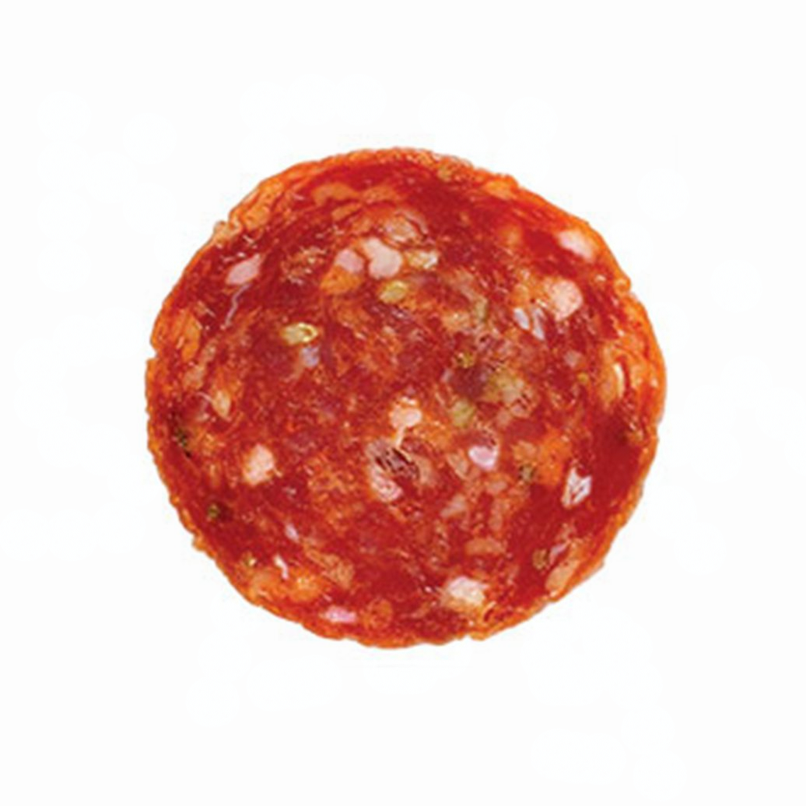
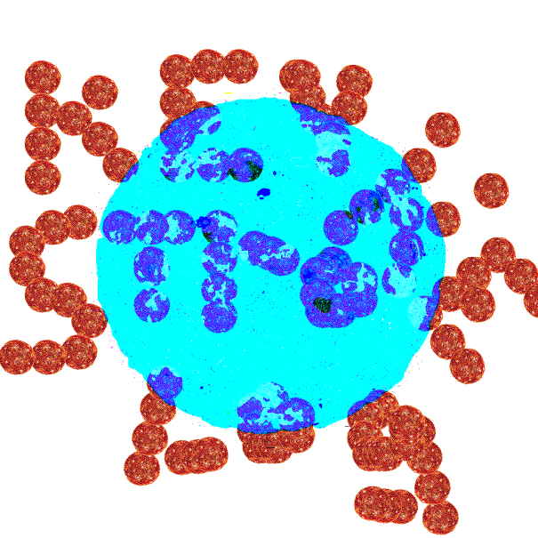

# The Pepperoni
 

 
**Figure A: The original JPEG**
  

 
**Figure B: The "identical" PNG**
  
On December 14, 2019, the Reddit channel [u/johndough1983](https://www.reddit.com/user/johndough1983/) created [this post](https://www.reddit.com/r/codes/comments/ea93ld/whats_behind_this_pepperoni/), titled: "What’s behind this pepperoni?".
Attached in the transcript was the two images pictured above. Though these images look identical on the surface, messing around in an image manipulation program may quickly reveal a hidden steganographic message. Improper placement of the slightly smaller png creates a large amount of nonsense over the large pepperoni. However, if placed correctly, the image should now look something like this:
  
 
 
**Figure C: Difference Between the Two Images, with a Photoshop Levels Layer on Top. (Courtesy of Hooptooth)**
  
The message appears to read: `KEY STROKE LOG`