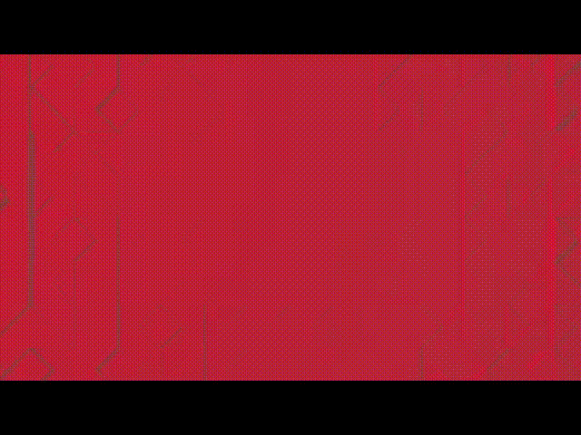
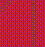
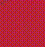
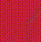
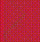

# Video 5
<iframe width="560" height="315" src="https://www.youtube.com/embed/epEQbVw1Gy4" frameborder="0" allow="accelerometer; autoplay; encrypted-media; gyroscope; picture-in-picture" allowfullscreen></iframe>

## Title

---

### That hard work paid off, as word of the quality of his goods spread across the land.

## Description

---

```
Never acquiesce health.
•
Then there was that time we drove to all those spots, sleeping in our cars along the way.
•
☺😀☺😀☺😀☺😀
```

### Line-One Code (Section 1)
When one examines line 1 of the description: "Never acquiesce health.", they will notice that the first letter of every word spells out `Nah`.

---

## Video Content

---

### Emojis

Throughout the video, the following series of animated emojis is displayed on loop:
<br>

<br>
[Silas](https://github.com/exvacuum) has created a pack of gifs for each emoji:
<br><br>
[:floppy_disk: cppemojis.zip](../assets/img/cppemojis/cppemojis.zip)

Transcript:

Coordinates:

`0x7 1x2 2x1 1x6 0x8 2x5 1x5 2x0` :imp: `0x2 2x2` :imp: `1x6 1x10 2x3 1x7 1x4 2x2 1x5 2x9`


Raw Emojis:

   
   

:imp:

 

:imp:

    
   

In base10, the transcript is `7 14 25 18 8 29 17 24` :imp:  `2 26` :imp: `18 22 27 19 16 26 17 33`

Encoded to base36 starting at the top-left corner as 0, the ciphertext reads `7EPI8THO 2Q IMRJGQHX`. Starting with A, it reads `HOZSI3RY C0 SW1TQ0R7`.

The signifigance of these emojis is yet unknown, nor is any connection to the emojis found in this video's description. This issue is considered highly important. The most simple solution, given the fact that 36 emojis are presented, is a base36 system. However, attempts so far have been unsuccessful.

The line of emojis that appears at the bottom of the screen over the course of the video is clearly of some importance, and any attempts at solving this are encouraged. A curious observation is that the demon emoji occurs multiple times in the bottom line, but never in the main set. A current theory is that the demon serves as a word-separating character.

Another mystery regarding the emojis is the larger, eyeless emojis which begin appearing after the first display of the set.