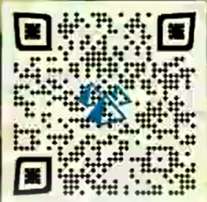

# Video 13
<iframe width="560" height="315" src="https://www.youtube.com/embed/9JdxSXKlN5o" frameborder="0" allow="accelerometer; autoplay; encrypted-media; gyroscope; picture-in-picture" allowfullscreen></iframe>

## Title

---

### They dotted the landscape like neon fireflies, filled with goods.

## Description

---

```
Use #your #8 #apples 3 x 2day
•
50.818997-97.259112
```

### Line-One Code (Section 1)
When one examines line 1 of the description: "Use #your #8 #apples 3 x 2day", they will notice that the first letter of every word spells out `Uy8a3x2`. The corresponding TinyURL link redirects to a [Fox 59 Article](https://fox59.com/2016/11/02/police-identify-man-killed-on-north-side-of-indianapolis/) regarding the killing of George Adrian in Indianapolis.

---

## Video Content

---

### Date
At 0:36, the following date appears in a red box:
```
nov-2-2004
```
This date is exactly 12 years prior to the date of the above article's publishing.

---

### Flashing Calligraphy
At 0:45, the following text appears in stylized calligraphy:
```
v99g6d6
```
The corresponding TinyURL link for this text leads to a [Tribune Star Article](https://www.tribstar.com/news/arrest_reports/vigo-county-jail-log-nov/article_f3dcf387-74cc-51fc-9779-8e220a2efd44.html) regarding the Vigo County Jail log for November 21, 2019.
<br><br>
At 1:37, more text appears in a similar style:
```
sekhshq
```
The corresponding TinyURL link leads to a [Indy Channel Article](https://www.theindychannel.com/news/local-news/indianapolis/meet-george-adrian-the-worlds-fastest-apple-picker-from-indianapolis) George Adrian, world's fastest apple picker, and father of the deceased George Adrian mentioned in the first article on this page.
 
---

### QR Code
At 0:52, the following QR code appears:
<br>

<br>
This QR leads to a [Daily Journal Article](http://www.dailyjournal.net/2019/08/12/adrian_orchards_for_sale_as_owners_look_to_retire/) regarding the listing of Adrian Orchards, the property owned by the parents of the deceased George Adrian mentioned in the first article on this page.
 
---
 
### Phone Number
At 2:21, the following phone number appears:
```
(317) 732-5009
```
At the time of this video's upload, this number lead to the voicemail of Capital Place Pizza, where orders could be placed. However, the number switched to the voicemail of Infrared Skate Supply Co. recently.
